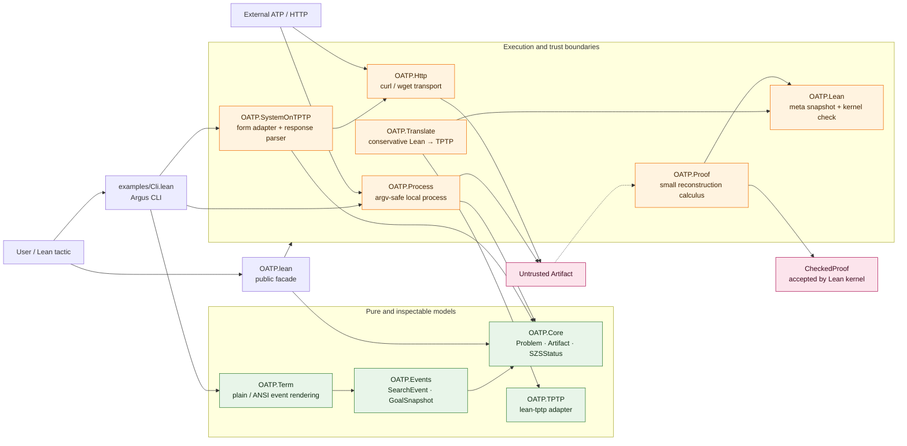
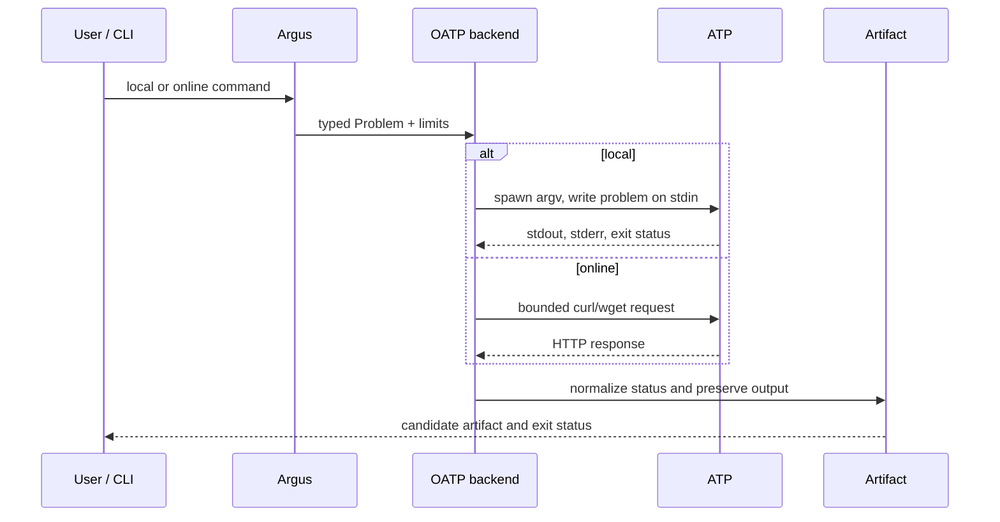

# OATP architecture

OATP is a proof-artifact-first orchestration layer. It turns Lean goals or
TPTP problems into bounded local or remote ATP runs, but never treats an ATP
answer as a Lean proof by itself.

## Component boundaries

The dashed edge is intentional: reconstruction consumes an external result
only as data. `OATP.Proof.reconstruct` builds a candidate expression and
`OATP.Lean.checkAndAssign` checks it against the metavariable before assigning
anything.

## Runtime flows

The current runtime limits are deliberately conservative:

- local process groups receive timeout termination requests;
- local and HTTP response limits are checked after capture;
- HTTP request bodies are rejected before transport when oversized;
- true streaming upload/response cancellation remains a future transport
  slice.

## Module ownership

| Area | Owner | Boundary |
| --- | --- | --- |
| Domain data | `OATP.Core` | no IO, no terminal, no proof claims |
| Search events | `OATP.Events` | renderer-independent data |
| TPTP syntax | `lean-tptp` via `OATP.TPTP` | parsing and formula rendering |
| Lean goals | `OATP.Translate` | supported fragment only; reject the rest |
| Kernel safety | `OATP.Lean`, `OATP.Proof` | candidate terms checked by Lean |
| Local ATPs | `OATP.Process` | argv, stdin, timeout, output limits |
| Remote ATPs | `OATP.Http`, `OATP.SystemOnTPTP` | curl/wget and typed response parsing |
| Terminal output | `OATP.Term` + TermColor libraries | pure rendering vs TTY IO |
| CLI | `examples/Cli.lean` + Argus | parsing, diagnostics, orchestration |

Sibling-library responsibilities stay narrow: Argus owns typed command parsing
and usage diagnostics; `termcolor-widgets` owns pure progress frames;
`termcolor-terminal` owns TTY detection, redraw, flushing, and cursor cleanup.

## Public entry points

- `import OATP.Core` for pure domain values;
- `import OATP.TPTP` for TPTP parsing and construction;
- `import OATP.Process` or `import OATP.Http` for execution boundaries;
- `import OATP.Lean` and `import OATP.Proof` for kernel-facing integrations;
- `import OATP` for the complete library facade;
- `lake exe oatp` for the standalone CLI.

The umbrella module is intentionally a convenience import. Internal modules
remain separately usable so consumers do not need to depend on the CLI.

## Deliberate next seams

1. Replace the command-backed HTTP edge only when Lean exposes a stable HTTPS
   client/session API.
2. Add streaming transport without changing `Problem`, `Artifact`, or the
   kernel trust boundary.
3. Parse ATP proof steps into `OATP.Proof.Step`; do not widen reconstruction
   until every accepted step remains kernel-checked.
4. Add stable JSON/artifact export at the CLI edge, not to the pure core.
