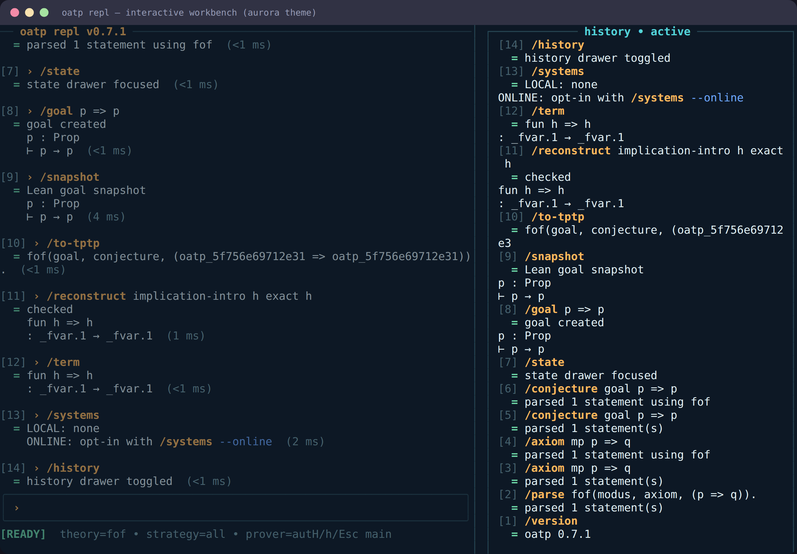
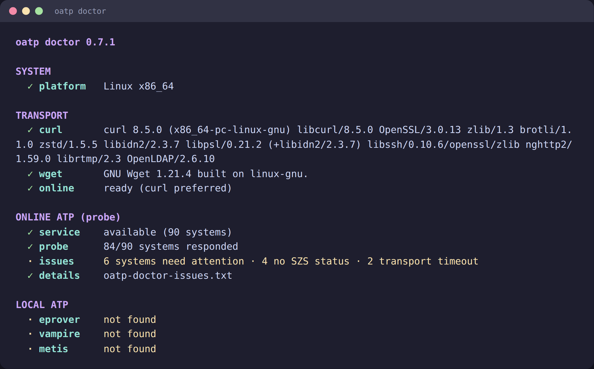

# oatp

[](https://github.com/jonaprieto/oatp/actions/workflows/ci.yml)
[](https://github.com/jonaprieto/oatp/releases)
[](lean-toolchain)
[](https://jonaprieto.github.io/oatp/)
[](LICENSE)

Orchestrated automated theorem proving for Lean 4 with TPTP parsing, local and online prover
runners, reproducible artifacts, diagnostics, and explicit trust boundaries.

External ATP output is a candidate result, not a Lean proof. Kernel-checked reconstruction is
available for the supported propositional calculus.

<p align="center">
  
  
</p>

## Status and review

These libraries are actively evolving and are developed with AI assistance and human review.
CI and machine-checked proofs provide useful evidence, but do not guarantee correctness,
soundness, portability, performance, or suitability for every use case. Validate behavior
and assumptions before relying on a release.

Reviewer feedback is welcome, especially on correctness, proofs, API design, usability,
portability, performance, documentation, and real-world use. Please use the
[issue tracker](https://github.com/jonaprieto/oatp/issues) or open a PR with a reproducible
example and the expected behavior.

## Install the binary

Install the latest release binary with [`jpillora/installer`](https://github.com/jpillora/installer):

```sh
curl https://i.jpillora.com/jonaprieto/oatp! | bash
oatp --help
```

The `!` installs the executable into `/usr/local/bin/`. For this private repository, configure
`GITHUB_TOKEN` on the installer server and client as described by its private-repository
instructions. To inspect the generated script before running it, omit `| bash`.

## Quick start

```sh
lake build
lake exe demo
lake exe proof-demo
lake exe oatp --help
lake exe oatp config
lake exe oatp config path
lake exe oatp systems
lake exe oatp repl
lake exe tests
```

### Prover backends

OATP does not bundle ATP executables. For local proving, install at least one supported prover
such as `eprover`, `vampire`, or `metis`, and make sure its executable is on `PATH`. OATP detects
installed local provers and uses the first available candidate by default. If you do not want to
install local provers, select an `online-*` prover from the SystemOnTPTP catalogue instead; that
mode requires network access and an up-to-date catalogue.

`oatp repl` keeps the TPTP context, conjectures, formulas, variables, symbols, history, Lean
goals, translated problems, prover artifacts, and kernel-checked terms in one session:

```text
/goal p => p
/load problem.p
/snapshot                 # refresh the current Lean goal
/to-tptp
/reconstruct implication-intro h exact h
/term
/check
/run --prover eprover
/local ./my-prover -- --arg
/online online-vampire       # use the matching SystemOnTPTP version
/systems --online
/info online-vampire
/strategy                 # show the current portfolio strategy
/doctor
/config
```

Use `/state` for the context drawer, `/history` for the transcript, and `--script FILE` for a
non-interactive session. `/to-lean` currently accepts the propositional TPTP fragment; terms and
quantifiers remain available for `/parse` and prover execution and return an explicit diagnostic
when a Lean signature is required.

`/snapshot` refreshes the local context and target after `/goal`; `/goal` already prints the first
snapshot, so use `/snapshot` when the Lean context may have changed. `/clear` clears the visible
transcript but keeps the TPTP context. `/reset` clears the transcript and resets the session
context.

`/theme` shows the current theme; `/theme NAME` selects one. `/info PROVER` requires a name and
checks installed local executables first, then the cached SystemOnTPTP catalogue. Use names such as
`online-vampire` without spelling out a version; `/systems --online --refresh` refreshes the
catalogue cache.

`/config` and `oatp config` show the effective preferences and the resolved config path. Preferences
are read by REPL startup; batch prover commands use their explicit options. Use `oatp config path`
when inspecting or editing the JSON file directly. The path is `$XDG_CONFIG_HOME/oatp/config.json`,
or `~/.config/oatp/config.json` when `XDG_CONFIG_HOME` is unset.

In the REPL, Ctrl-H toggles history, Ctrl-S toggles state, and Ctrl-R toggles the latest run.
When the state drawer has formulas, ↑/↓ selects them; Delete or `d` prepares `/remove #N`.

Prover runs use the `all` strategy by default, so every selected prover is checked. Set
`/strategy first-success` for a sequential fallback portfolio that stops after the first
`Theorem` or `Unsatisfiable` result; `/strategy all` restores parallel execution. A first failure
is not a useful stopping strategy because one prover timing out should not hide a later success.

Context entries have stable `#` indices in the state drawer. Remove or replace them without
rebuilding the session:

```text
/remove #2
/update #2 fof(goal, conjecture, q => q).
```

The command cell shown in brackets is the input that created the entry; it is not its context
index. Includes are indexed too, but can only be removed, not replaced by a formula.

Use `/check` for a beginner-friendly check with the configured default prover and any selected
provers. Its transcript result is collapsed by default: click the `▸` report header to expand it;
press `Ctrl-R` to open the run drawer with the full multiline output.
Use `/run` when choosing an explicit prover or portfolio.

Each local or online prover request saves its exact input and captured output under `.oatp/` in
the current directory. If that directory is not writable, OATP uses the same per-user directory
as its preferences (`$XDG_CONFIG_HOME/oatp` or `~/.config/oatp`).

Run a local problem or select an online system explicitly:

```sh
lake exe oatp run problem.p
lake exe oatp run --prover eprover problem.p
lake exe oatp run --prover online-vampire problem.p
```

Without `--prover`, `run` uses the first installed local prover. Set
`OATP_LOCAL_PROVERS` to control the local candidate order; online systems are opt-in.

## Provides

- pure prover, artifact, outcome, limit, and search-event models;
- Grip-backed [`tptp`](https://github.com/jonaprieto/lean-grip-tptp) parsing;
- bounded local process and HTTP transport;
- concurrent local-prover portfolios;
- SystemOnTPTP catalogue and cache;
- shared Argus option specs for the batch CLI and REPL;
- proposition-to-TPTP translation and small kernel-checked reconstruction;
- plain and ANSI terminal rendering through the [TermColor stack](https://github.com/jonaprieto/lean-termcolor).

The standalone CLI is available in release archives. The Lean library can be installed with:

```lean
require oatp from git
  "https://github.com/jonaprieto/oatp.git" @ "v0.7.4"
```

## Build

```sh
lake build OATP OATP.Properties demo proof-demo oatp tests
lake exe tests
```

## Related projects

OATP grew out of the archived Haskell [`online-atps`](https://github.com/jonaprieto/online-atps)
project, which remains a historical reference for its online-prover integration.

[`oatp-proofwidgets`](https://github.com/jonaprieto/oatp-proofwidgets) provides optional Infoview
views. [`argus`](https://github.com/jonaprieto/lean-argus) provides typed CLI parsing;
[`grip`](https://github.com/jonaprieto/lean-grip) and [`termcolor`](https://github.com/jonaprieto/lean-termcolor)
provide parsing and text foundations; [`termcolor-diagnostics`](https://github.com/jonaprieto/lean-termcolor-diagnostics),
[`termcolor-terminal`](https://github.com/jonaprieto/lean-termcolor-terminal),
[`termcolor-widgets`](https://github.com/jonaprieto/lean-termcolor-widgets), and
[`termcolor-repl`](https://github.com/jonaprieto/lean-termcolor-repl) provide the application stack.

The CLI and REPL share `OATP.Argus` resource, catalogue, and online-service option specs; their
different problem/session positionals remain frontend-specific.

For the `v0.6` migration, `RunRequest.references` is now typed as
`List OATP.ProverReference`; option records expose shared groups under `resources`, `catalogue`,
and `remote`. Legacy persisted prover names remain accepted and are rewritten with `local:` or
`online:` prefixes.

## License

Apache-2.0.
